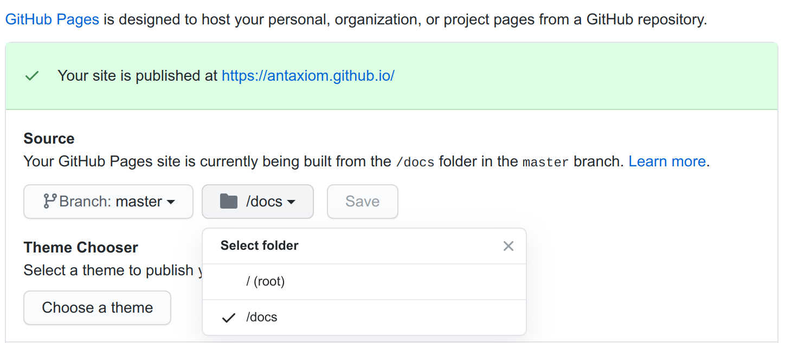

<meta property="og:title" content="Creating a blog with a POSIX ssg and Github pages" />
<meta property="title" content="Creating a blog with a POSIX ssg and Github pages" />
<title>Creating a blog with a POSIX ssg and Github pages</title>
# Creating a blog with a POSIX ssg and Github pages

###### September 22, 2020

## What is ssg?

Ssg is self described as "a static site generator written in shell. Optionally it converts Markdown files to HTML with lowdown(1) or Markdown.pl"

It's written by a fellow called [Roman Zolotarev](https://www.romanzolotarev.com/)

_image of the sgg4 source code as featured on Roman's site_
  

It's very lightweight and easy to use, and as said earlier it's completely written in shell script

## Why should I use a script instead of a full static site generator?

Most static site generators are unecesarily heavy with a lot of features you won't need, especially for the purposes of a small site like mine

## How do I use ssg5?

Using ssg is pretty simple but I don't think I'm fit for the task of explaining the exact use cases so I'll leave some useful links here:

[The author's official page and guide](https://www.romanzolotarev.com/ssg.html)

[Wolfgang's Video on the subject](https://www.youtube.com/watch?v=N_ttw2Dihn8)

## ssg5 modifications

Wolfgang has made a [modified version](https://notthebe.ee/src/ssg5) which he explains [in his video](https://www.youtube.com/watch?v=N_ttw2Dihn8)

Now the problem with this version is that it doesn't work on Linux (and probably other unix systems) since [cut is a bit different](https://stackoverflow.com/questions/43171648/sed-gives-sed-cant-read-no-such-file-or-directory) on MacOS

[My version](https://raw.githubusercontent.com/antaxiom/antaxiom.github.io/master/bin/ssg5) has a check so it should work on both MacOS and Linux

## Github pages integration

This is where I come in,
since I don't have my own server I decided to use Github pages as means of hosting my site

First thing to note, Github requires to have your site either in the `/` or the `docs/` folder of your repo

So you have to make sure ssg5 exports to `/docs` as `/` is obviously not viable

You can facilitate building with a [makefile](https://makefiletutorial.com/), you can reference [mine](https://github.com/antaxiom/antaxiom.github.io/blob/master/makefile) as a example of what _not_ to do

## You're done!

The site you're looking at right here was made using this exact method (could you tell?) if you want to look into some of the source feel free, it's available [here](https://github.com/antaxiom/antaxiom.github.io)

After this you can add some css to the site ([here's mine](https://github.com/antaxiom/antaxiom.github.io/blob/master/src/style.css)) and add something like a `.htaccess` file so you can get a clean address bar
